# IPL scedule 2023 crawling

### 요약
[IPL scedule](https://timesofindia.indiatimes.com/sports/cricket/ipl/schedule)을 주기적으로 크롤링하여 DB를 업데이트 합니다. docker-compose 환경을 구축했습니다.

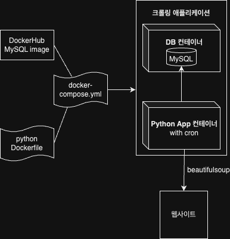

 

### 기술 스택
크롤링앱 : python3, beautifulsoup4  
DB : MySQL  
스케줄링 : cron  
컨테이너 환경 : docker image, docker-compose

 

### DB 요약
DB : IPL_schedule  
TABLE : IPL2023  
FIELD :  
|필드|속성|
|------|---|
|id (key)|int|
|title|str|
|start_date|date|
|venue|str|
|teams|str|
|created_at|date|
|updated_at|date|

 

### bash 가이드
docker-compose.yml로 이미지 파일들을 빌드하여 컨테이너에 띄웁니다.
> docker build -t ipl_crawling .  
> docker compose up -d

 

### 컨테이너 내부 주요 파일 위치
cron.log : /var/log/cron.log  
corn : /etc/cron.d/cron  
crawling.py : /root/crawling.py

 

### 스케줄러 변경
(실행 스케줄 기본 시간 간격 : 1분)  
cron 파일 수정 후  
> crontab /etc/cron.d/cron reload

 

### 동작 이미지
#### 컨테이너 생성
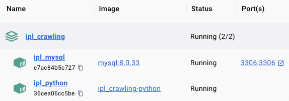
#### 생성 직후 초기 DB
테이블 없이 db만 생성된 상태  
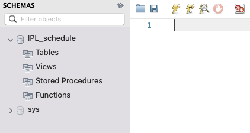
#### cron.log
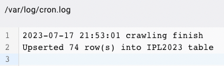
#### table 생성 및 데이터 insert
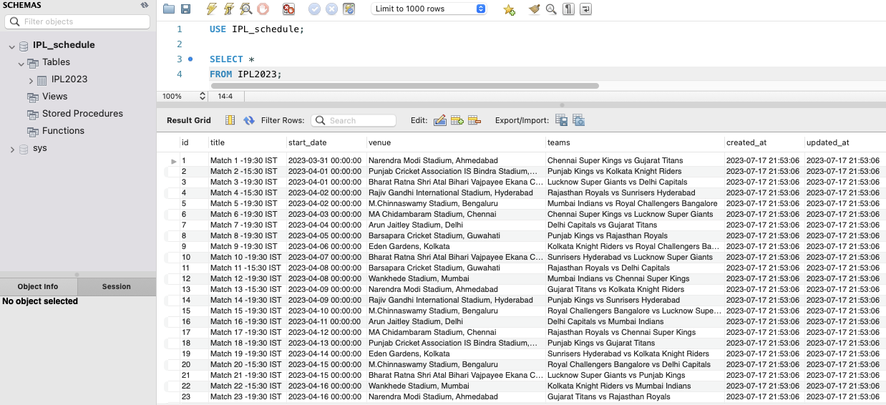
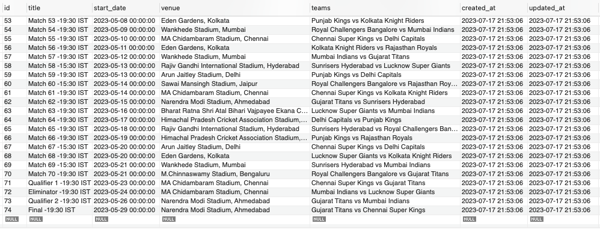
#### 쿼리문 수정
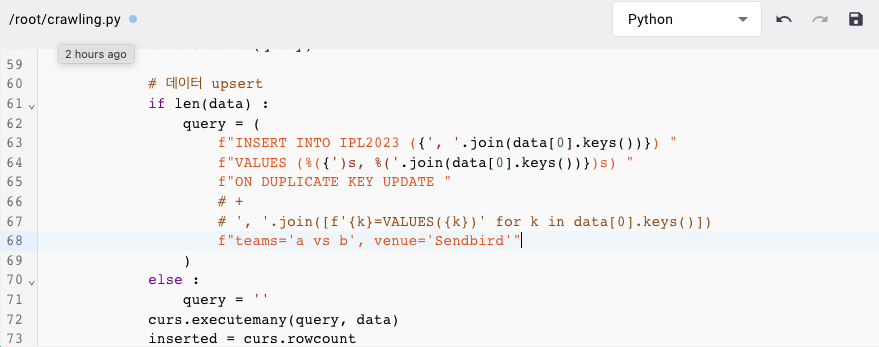
#### 즉각 반영
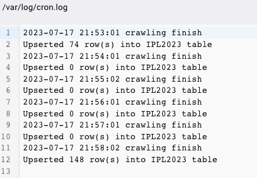
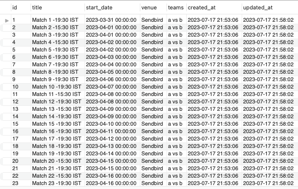
#### cron 수정, 반영
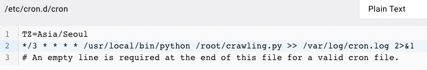
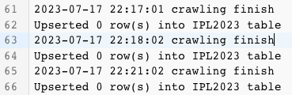